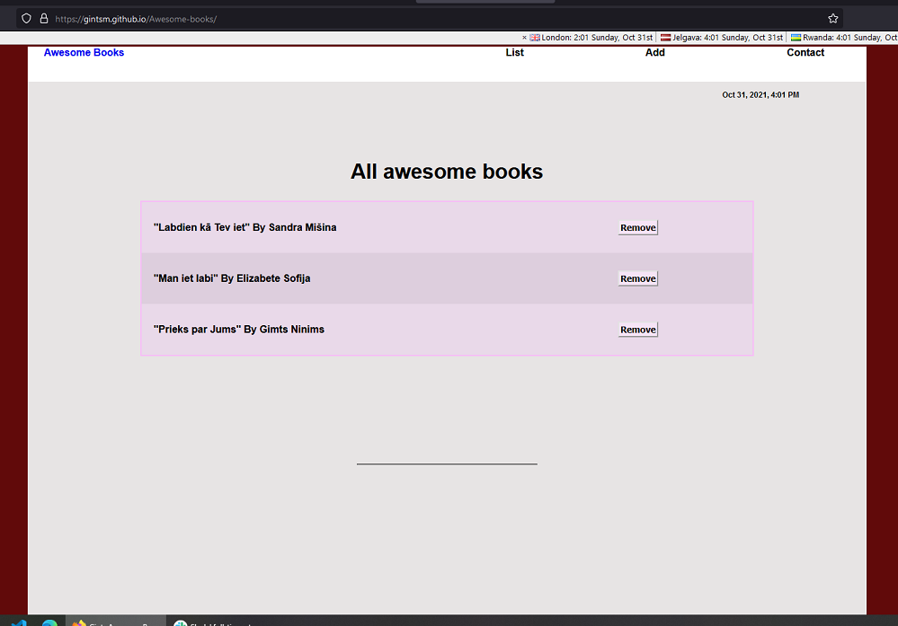
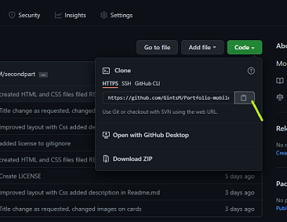

# Awesome-books
Plain JavaScript with objects
    

     
    

## Project contains:

- Page with option to add and remove books. Books stored in local storage 
- this will follow in next pull request

## Build with   
   * HTML
   * CSS
   * JavaScript

## Getting Started
* Prerequisites Create an account on github
* Install gitbash or use git on the command line.

* Use an IDE of your preference such as VScode.

Steps to: you should copie the link (marked with a green line)
    

        

     
    

Clone the repository to your locaL machine. Enter your github credentials if prompted.

Open the index.html file with the browser of your preference.

## 👤 Author1
  * GitHub: [GintsM](https://github.com/GintsM) 
  * LinkedIn: [Gints Misins](https://www.linkedin.com/in/gints-misins-756b2321a/)

## Live Demo

To see the live Demo of the project [here](https://gintsm.github.io/Awesome-books/)

## Show your support
Give a ⭐️ if you like this project!

## 📝 License
This project is MIT licensed.
